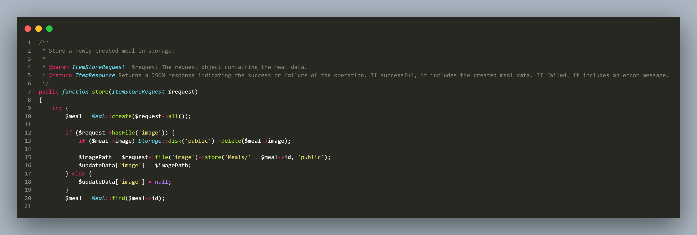

# FoodScan API - POS Management System

Welcome to the Food Order Management System! This project is a comprehensive control panel designed for cashier systems to efficiently manage food orders. The system includes a user-friendly interface for administrators, employees, and customers, providing functionalities such as order tracking, invoicing, sales reporting, and more. It's a perfect solution for restaurants and cafes looking to streamline their order processing and enhance customer satisfaction.

# Summary as an example

## items routes

items routes api.

## index endpoint

read data endpoint.

## store endpoint

store new data.

## show endpoint

show single record.

## update endpoint

update state data.

## destroy endpoint

destroy record.

## search endpoint

search data.

## Contact me

### If you have any questions or need further assistance, you can reach out to me:

### Email: eslamalsayed8133@gmail.com

### LinkedIn: [IslamAlsayed](https://www.linkedin.com/in/islam-alsayed7)
